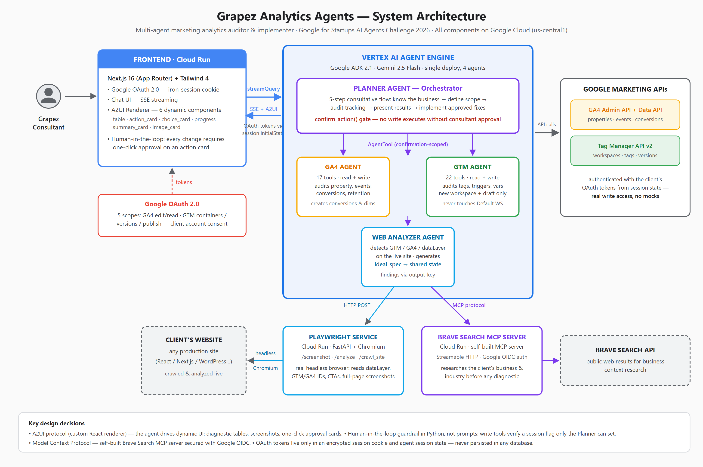

# Grapez Analytics Agents
### Google for Startups AI Agents Challenge 2026 — Track 1 (Build)

A multi-agent system that connects to a client's Google account and **audits + fixes their entire marketing measurement ecosystem** — Google Analytics 4, Google Tag Manager and the live website — in minutes instead of days, with a human approving every change.



## The Problem

Setting up and auditing a client's measurement ecosystem (GA4 + GTM + website tracking) takes consultants **1–3 days of manual work per client**. The same errors repeat across clients: missing conversion events, duplicated tags, broken dataLayers, 2-month data retention. Grapez Studio does this for e-commerce and lead-gen clients — this system 3x's consultant capacity with the same team.

## The Solution

Four specialized agents built with **Google ADK** and **Gemini 2.5 Flash**, deployed on **Vertex AI Agent Engine**:

| Agent | Role |
|---|---|
| **Planner Agent** | Orchestrator. Runs a 5-step consultative flow: understands the business first, then defines scope, audits, presents results and implements approved fixes |
| **GA4 Agent** | 17 tools. Audits properties, events, conversions and retention via GA4 Admin + Data APIs — and creates conversions/dimensions on approval |
| **GTM Agent** | 22 tools. Audits tags, triggers and variables via GTM API v2 — implements in a fresh workspace, drafts versions, never touches production without approval |
| **Web Analyzer Agent** | Crawls the live site through a real headless browser, detects GTM/GA4/dataLayer implementations and generates the ideal tracking spec for that specific business |

### What makes it different

- **Human-in-the-loop enforced in Python, not prompts** — every write tool checks a session flag that only the Planner's `confirm_action()` can set after the consultant clicks approve on an action card. One confirmation covers exactly one action.
- **A2UI protocol** — the agent drives dynamic UI: diagnostic tables, live website screenshots, one-click approval cards, progress indicators. Custom React renderer (6 components).
- **Model Context Protocol (MCP)** — a self-built Brave Search MCP server (Streamable HTTP on Cloud Run, secured with Google OIDC) lets the Planner research the client's business before any diagnostic.
- **Real write access, no mocks** — agents act on real GA4 properties and GTM containers using the client's OAuth tokens, which live only in an encrypted session cookie and agent session state. No database.

## Tech Stack

- **Google ADK 2.1** — multi-agent orchestration (`LlmAgent` + `AgentTool` + function tools)
- **Gemini 2.5 Flash** via Vertex AI — model for all four agents
- **Vertex AI Agent Engine** — managed agent runtime (single deploy, SSE streaming)
- **Cloud Run** ×3 — Next.js 16 frontend · Playwright Service (FastAPI + Chromium) · Brave Search MCP server
- **A2UI** — agent-driven dynamic UI, custom React/Tailwind renderer
- **GA4 Admin API + GA4 Data API + GTM API v2** — full read/write with the client's OAuth tokens

## Architecture

See the diagram above — source at [`architecture/diagram.svg`](architecture/diagram.svg). Highlights:

1. The consultant authenticates with Google OAuth (5 scopes); tokens travel in an encrypted iron-session cookie and reach the agents via session `initialState`.
2. The frontend streams the Planner's responses over SSE and renders A2UI blocks as interactive components.
3. The Planner orchestrates the three specialist agents as tools, sharing context (ideal spec, GA4 findings) through session state.
4. Browser work runs in a separate Cloud Run service (Agent Engine has no Chromium); business research goes through the MCP server.

## Demo

[Video demo link — YouTube]

Live app: https://grapez-frontend-hgsyggbcaq-uc.a.run.app

## Local Setup

```bash
git clone https://github.com/MauricioHoyosArdila/grapez-hackathon
cd grapez-hackathon

# Agents
python -m venv .venv && .venv/Scripts/activate   # Windows: .venv\Scripts\Activate.ps1
pip install -r requirements.txt
cp .env.example .env                              # fill in your values
gcloud auth application-default login
adk web agents/planner_agent

# Frontend
cd frontend && npm install && npm run dev

# Deploy (Windows PowerShell)
.\scripts\deploy-agents.ps1      # agents → Vertex AI Agent Engine
.\scripts\deploy-frontend.ps1    # frontend → Cloud Run
```

## Built by

[Grapez Studio](https://grapez.co) — Growth Marketing Agency · Mauricio Hoyos & Juan Camilo
